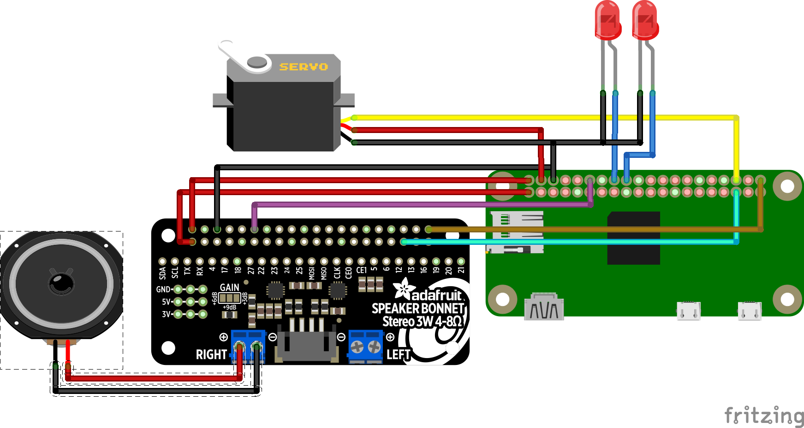

# Train Signal Announcer


This code is part of a project to turn an old Lionel train signal into a real train arrival announcer complete with working lights and gate motion. This Python code fetches arrival/departure information from Amtrak, and - when a train arrival or departure is in progress at the configured station - creates an retro sounding announcement using some background audio and text-to-voice generated using AWS Polly. It also uses Raspberry Pi GPIO to actuate the Lionel signal's gate and flash its caution lights.

## Usage

This code has a few entrypoints for testing and using the code:

* `get_data.py` gets the latest Amtrak data and pretty prints it
* `main.py` is the main program to monitor for arrivals or departures and then play the full audio and fire GPIO to announce and signal the trainm
* `test_amtrak.py` tests the code to wait for an arrival or departure and prints its information to standard out
* `test_signal.py` tests the GPIO code to actuate the gate and blink the caution lights

## Configuration

The code uses a few environment variables to control the software:

* `AUDIO_DIR` is the location of the audio samples to use for announcement generation
* `STATION_CODE` is the desired station code to monitor for arrivals and departures

Note the audio generation code uses an AWS service and `boto3`. It will use the default AWS profile configured for the machine.

## Requirements

* Python 3
* PIP

## Installation

This code is designed to run on a Raspberry Pi with the following GPIO connections:



There is also a `trainannouncer.service` file that you may use to run `main.py` as a service. To install that:

```bash
% sudo apt install python3 python3-pip
% git clone https://github.com/johnjones4/train-announcer
% cd train-announcer
% pip3 install -r requirements.txt
% sudo cp trainannouncer.service /etc/systemd/system/trainannouncer.service
% sudo systemctl daemon-reload
% sudo systemctl enable trainannouncer.service
% systemctl start trainannouncer.service
```
